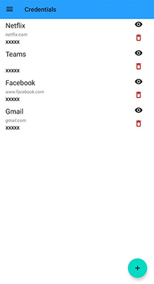
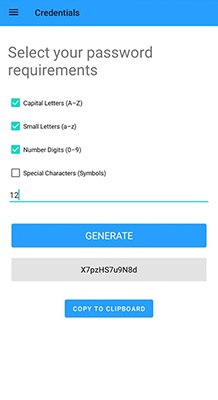
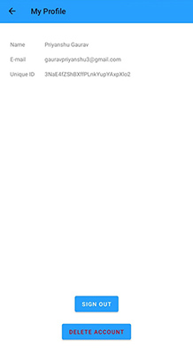

# Credentials

## Overview
In today's world of ever-growing popularity of the Internet, most of the works are being done online. And now in a situation of pandemic, almost all the business, works and even studies had to be done in online mode. And almost every platform requires you to login with your account so there is an increasing need of managing passwords.
This app is intended to fulfil that need by storing and displaying your passwords along with username and its website, and also provides a customized, strong password-generator that generates passwords to be used at any place.    

## Based on Google's Firebase API for storage and login
### Firebase Firestore
Cloud Firestore is a flexible, scalable NoSQL database for mobile, web, and server development from Firebase and Google Cloud. Like Firebase Realtime Database, it keeps your data in sync across client apps through realtime listeners and offers offline support for mobile and web so you can build responsive apps that work regardless of network latency or Internet connectivity.
The app uses Google's Firebase Firestore API to store and retrieve the stored passwords and related data.

It uses Firebae Auth UI to login to each user's respective user-accounts and then retrieve the data.
#

Since the app is not available on Google Playstore yet, use the apk provided in the APK folder to install the app in your mobile.

  
  